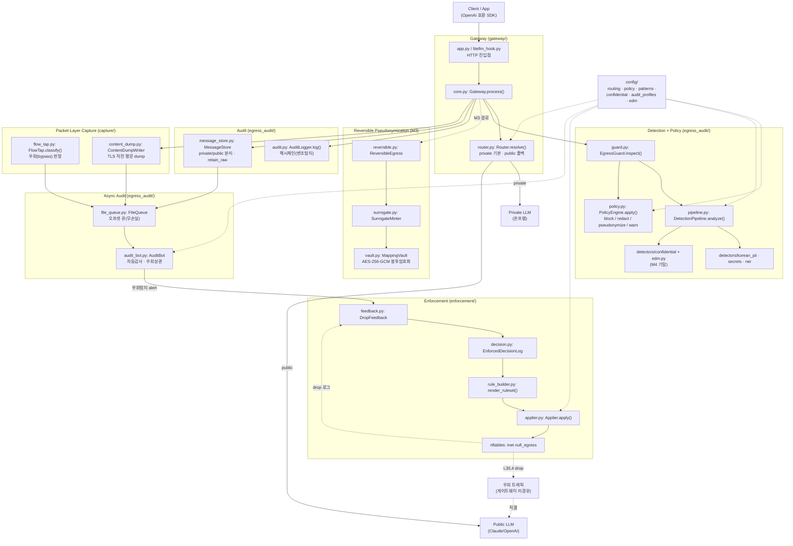
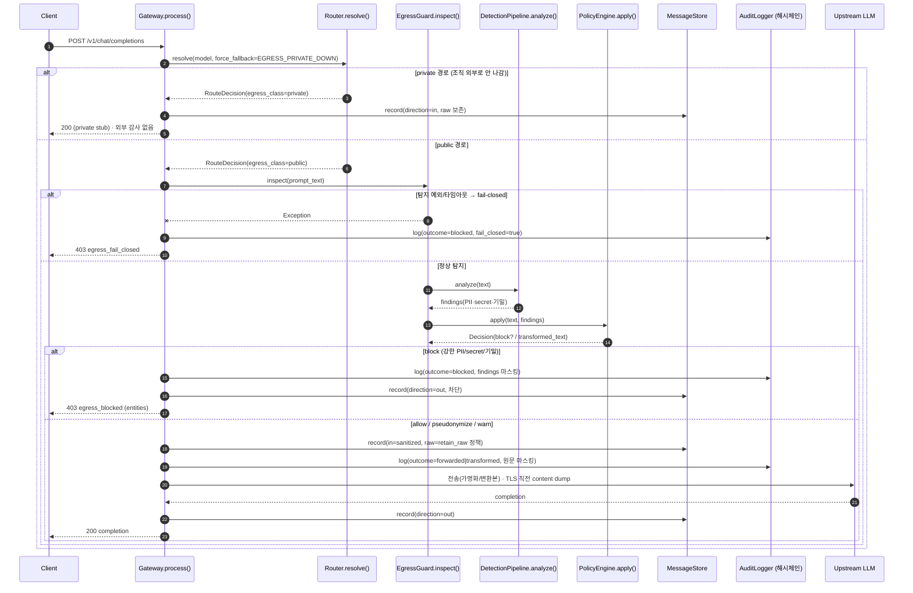
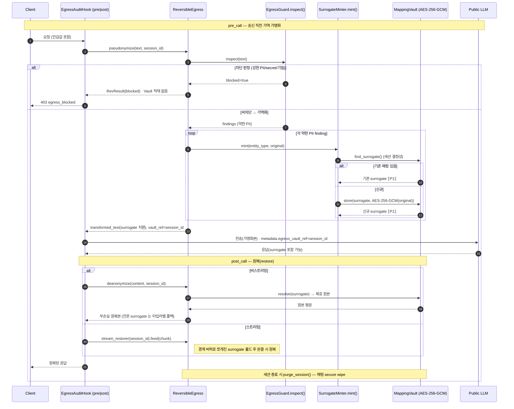
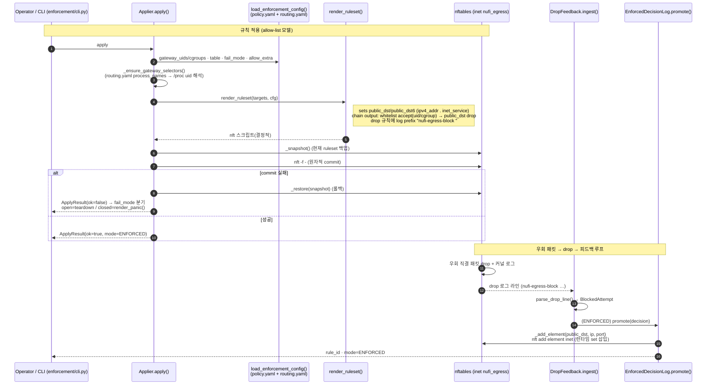
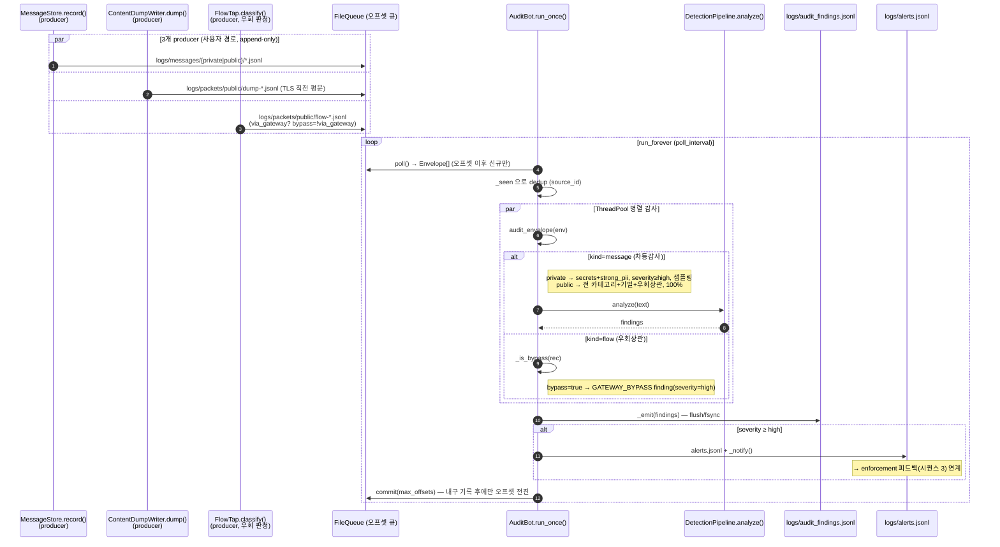

# NuFi Egress-Audit Gateway — Architecture (단일 권위 문서)

> **이 문서가 아키텍처의 단일 권위(single source of truth)** 입니다. 마일스톤별 SPEC(`SPEC*.md`)·구현
> 노트(`IMPL_M4.md`, `ENFORCEMENT_BUILD_CMP94.md`)·측정 리포트(`M5_MEASUREMENT_REPORT.md`)는 **역사적/세부**
> 자료로 남기며, 흐름·컴포넌트의 현행 정합은 이 파일을 따릅니다.
>
> 다이어그램은 외부 이미지가 아니라 **in-repo Mermaid** 입니다. 코드와 같은 PR 에서 갱신되어 드리프트에
> 강합니다(아래 [§7 드리프트 방지](#7-드리프트-방지-drift-resistance) 참조).
>
> 버전: **v0.0.1** ([`../VERSION`](../VERSION)·[`../CHANGELOG.md`](../CHANGELOG.md)) · 출처: CMP-113 (보드 CMP-112)

---

## 1. 한눈에

하이브리드 LLM(**private 우선 + public 폴백**) 환경에서 public LLM(Claude/OpenAI 등)으로 나가는 outbound
요청을 **게이트웨이로 가로채** 한국어 PII·비밀·기밀을 인라인으로 **탐지 → 판정(block/pseudonymize/warn)
→ (가역) 가명화 → 감사**한다. 게이트웨이를 우회한 직결 트래픽은 **패킷레이어에서 탐지**하고 **nftables 로
실제 차단**한다. 모든 public 경로는 변조탐지 **해시체인** 감사로그에 100% 적재된다.

핵심 불변식:
- **fail-closed**: 탐지 파이프라인이 예외/타임아웃이면 해당 요청은 **차단**(열림 폴백 금지). → `gateway/core.py`
- **원문 미저장**: 감사로그에는 원문 PII 평문을 저장하지 않는다(가명화/마스킹본만). 원문은 통제된 싱크의
  `retain_raw` 정책에만 보존. → `gateway/core.py`·`egress_audit/message_store.py`
- **외부 호출 0**: 탐지·키소스·암복호 전부 온프렘 로컬(NFR1). 매핑 Vault 는 AES-256-GCM, at-rest 평문 키 0.

---

## 2. 컴포넌트 / 컨테이너 다이어그램



**컴포넌트 책임 요약**

| 컴포넌트 | 모듈 | 핵심 진입점 |
|---|---|---|
| capture (게이트웨이 진입) | `gateway/app.py`, `gateway/litellm_hook.py` | `EgressAuditHook.async_pre_call_hook` |
| gateway 코어 | `gateway/core.py` | `Gateway.process()` |
| 라우팅 | `gateway/router.py` | `Router.resolve()` (private 기본, public 폴백) |
| detection (PII/secret) | `egress_audit/pipeline.py` | `DetectionPipeline.analyze()` |
| detection (기밀, M4) | `egress_audit/detectors/confidential.py`, `egress_audit/edm.py` | `EdmMatcher.match()` |
| 정책 판정 | `egress_audit/policy.py` | `PolicyEngine.apply()` |
| 가역 가명화 (M3) | `egress_audit/reversible.py`, `surrogate.py`, `vault.py` | `ReversibleEgress.pseudonymize/deanonymize` |
| egress_audit (로그) | `egress_audit/audit.py` | `AuditLogger.log()` + `verify_chain()` |
| 메시지 스토어 | `egress_audit/message_store.py` | `MessageStore.record()` (retain_raw) |
| 패킷 캡처 | `capture/flow_tap.py`, `capture/content_dump.py` | `FlowTap.classify()`, `ContentDumpWriter.dump()` |
| 비동기 감사봇 | `egress_audit/audit_bot.py`, `file_queue.py` | `AuditBot.run_once()` |
| enforcement (nftables) | `enforcement/` | `Applier.apply()`, `render_ruleset()` |
| config | `config/*.yaml` | routing·policy·patterns·confidential·audit_profiles·edm |

---

## 3. 시퀀스 1 — 주 egress 흐름 (탐지 → 판정 → 업스트림 → 감사)

`gateway/core.py: Gateway.process()` 기준. private 기본, private 불가 시 public 폴백. public 경로만 탐지·감사.



> **표기**: 감사로그(`AuditLogger`)에는 원문 PII 평문을 넣지 않는다 — `_mask_finding()` 이 `text` 를
> `len=…:sha256=…` 단축해시로 치환. 원문은 `MessageStore.retain_raw("public")` 가 참일 때만 통제된 싱크에 보존.

---

## 4. 시퀀스 2 — M3 가역 가명화 / 원복 (라운드트립)

`egress_audit/reversible.py: ReversibleEgress` + `gateway/litellm_hook.py`(프로덕션 LiteLLM 경로). 약한 PII
(`KR_PERSON·KR_PHONE·EMAIL·KR_BRN·KR_LOCATION`)만 가역화. 강한 PII/secret/기밀은 M2 차단 경로 그대로(회귀 없음).



> **Vault 불변식**: 원본은 평문 저장 안 함(가명화 즉시 AES-256-GCM). 세션 DEK 를 KEK 로 봉인(at-rest 평문 키 0),
> 세션 파티션 + TTL + 확정 삭제. 역방향 중복판정은 `lookup_key_hash`(HMAC)로 원본 노출 없이 수행.

---

## 5. 시퀀스 3 — 우회 탐지 + 차단 (nftables MVP, CMP-94)

게이트웨이를 우회한 public LLM 직결 패킷을 패킷레이어에서 탐지(시퀀스 4)하고, `enforcement/` 가 nftables
허용목록으로 **실제 L3/L4 drop** 한다. 정책 단일 출처: `config/policy.yaml` 의 `enforcement:` + `routing.yaml`.



> **dry-run vs apply**: nft 바이너리/권한이 없으면 `Applier` 가 자동으로 dry-run(규칙 텍스트만 반환). **kill-switch**:
> `disable()` → `render_teardown()` 로 테이블 전체 제거. **fail-closed**: `fail_mode: closed` 시 적용 실패하면
> `render_panic()`(허용목록 없는 전면 drop). 기본 `fail_mode: open`(가용성 우선).

---

## 6. 시퀀스 4 — 비동기 감사봇 · 차등감사 · 패킷레이어 우회탐지 (CMP-85)

사용자 경로(시퀀스 1)는 producer 가 로그를 append 만 하고 **즉시 반환**(지연 0). 별도 비동기 `AuditBot` 이
오프셋 큐로 소비해 **차등감사**(private 경량 / public 전수)와 **우회상관**을 수행한다. 봇 사망이 사용자 경로에 영향 없음.



> **차등감사**: `config/audit_profiles.yaml` 의 프로파일로 private(경량: secrets·strong_pii, 샘플링)과
> public(전수: 약한 PII·기밀·`bypass_correlation` 포함)을 구분. **무손실**: `FileQueue` 는 commit 전까지 오프셋을
> 전진시키지 않아 크래시 시 재처리 안전. **NFR5**: 각 finding 에 `latency_ms` 기록 → `p95_latency_ms()`(목표 ≤5s).

---

## 7. 드리프트 방지 (Drift-Resistance)

> **핵심 통증(CMP-112): 작업이 진행될수록 docs 가 out-of-date 가 됨.** 아래 장치로 ARCHITECTURE.md 를 코드와
> 같은 PR 에서 강제 동기화한다.

### 7.1 단일 권위 + 이력 강등
- 본 `ARCHITECTURE.md` 가 **아키텍처 진입점**(단일 권위). `docs/README.md` 인덱스가 이를 최상단으로 링크.
- 마일스톤 SPEC(`SPEC.md`·`SPEC_CMP85.md`·`SPEC_EGRESS_ENFORCEMENT.md`·`SPEC_M4.md`)과 IMPL/측정 노트는
  **역사적/세부**로 강등 — "왜·당시 결정"의 근거로만 참조하고, 현행 흐름은 본 문서가 권위.

### 7.2 문서 정합성 체크리스트 (흐름 바꾸는 PR/마일스톤 필수)
아래 중 하나라도 바꾸는 PR 은 **같은 PR 에서 ARCHITECTURE.md 를 갱신**한다(미갱신 시 리뷰 reject):

- [ ] 컴포넌트 추가/삭제/이름 변경 (`gateway/`·`egress_audit/`·`capture/`·`enforcement/` 모듈·클래스).
- [ ] 시퀀스 흐름 변경 (라우팅 판정, 탐지/정책 순서, M3 라운드트립, enforcement 규칙, 감사봇 차등감사).
- [ ] 핵심 진입점 시그니처 변경 (§2 표의 "핵심 진입점" 함수/메서드명).
- [ ] 불변식 변경 (fail-closed, 원문 미저장/retain_raw, 외부호출 0, Vault at-rest 암호화).
- [ ] config 키 변경 (`policy.yaml`·`routing.yaml`·`audit_profiles.yaml`·`confidential.yaml`·`edm`).
- [ ] 릴리스 시: `VERSION`·`CHANGELOG.md`·known-limitations 동시 갱신.

### 7.3 경량 검증
- **Mermaid 유효성**: 본 문서의 5개 Mermaid 블록(컴포넌트 1 + 시퀀스 4)은 GitHub/VS Code Mermaid 렌더로
  검증. 코드펜스 ` ```mermaid ` 언어태그 유지 → 자동 렌더.
- **식별자 대조(docs-owner 노트)**: §2 표와 시퀀스의 모듈/클래스/함수명은 실제 코드와 1:1 — 변경 시
  grep 로 대조(예: `grep -rn "def process" gateway/core.py`). 본 v0.0.1 은 `Gateway.process`,
  `Router.resolve`, `DetectionPipeline.analyze`, `PolicyEngine.apply`, `EgressGuard.inspect`,
  `ReversibleEgress.pseudonymize/deanonymize`, `MappingVault.store/resolve`, `AuditLogger.log/verify_chain`,
  `FlowTap.classify`, `AuditBot.run_once`, `Applier.apply`, `render_ruleset`, `EnforcedDecisionLog.promote` 대조 완료.
- **오너십**: 문서 오너 = Engineer(보안 도메인 상시승인 CMP-96). 설계 변경 명세는 CPO 산출 → Engineer 가
  코드와 함께 본 문서 반영.

---

## 8. 관련 문서

- 읽기 순서·상태표: [`docs/README.md`](README.md)
- 제안/배경: [`PROPOSAL.md`](PROPOSAL.md) · 기반 명세: [`SPEC.md`](SPEC.md)
- CMP-85(차등감사·패킷·봇): [`SPEC_CMP85.md`](SPEC_CMP85.md) · [`DEMO_CMP85.md`](DEMO_CMP85.md)
- Enforcement: [`SPEC_EGRESS_ENFORCEMENT.md`](SPEC_EGRESS_ENFORCEMENT.md) · [`ENFORCEMENT_BUILD_CMP94.md`](ENFORCEMENT_BUILD_CMP94.md)
- M4 기밀: [`SPEC_M4.md`](SPEC_M4.md) · [`IMPL_M4.md`](IMPL_M4.md)
- M5 실측: [`M5_MEASUREMENT_REPORT.md`](M5_MEASUREMENT_REPORT.md)
- 릴리스: [`../CHANGELOG.md`](../CHANGELOG.md) · [`../VERSION`](../VERSION)

*최초 작성: 2026-06-27 (CMP-113, Engineer) — v0.0.1 단일 권위 아키텍처 + 4개 시퀀스 Mermaid. 코드 대조 완료.*
