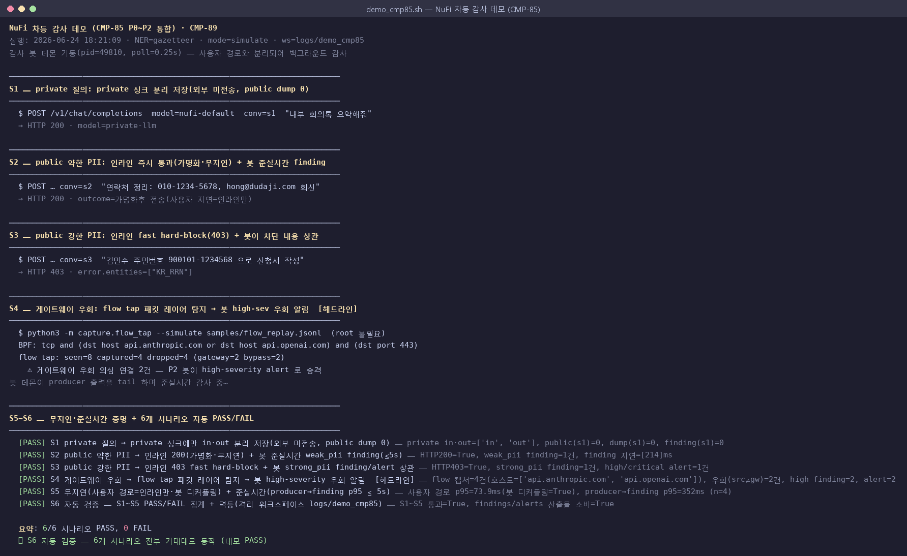
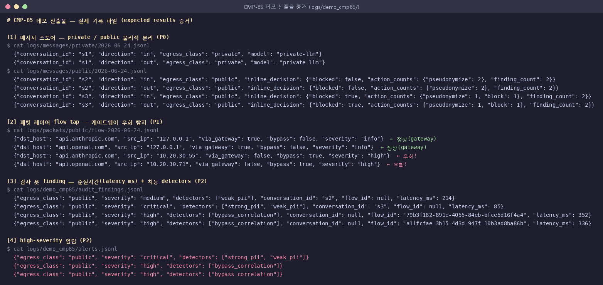

# CMP-85 데모 결과 보고서 — Public/Private 차등 감사 + 패킷 레이어 + 비동기 감사 봇

작성: CPO (NuFi) · 실행·검증 일자: 2026-06-24 · 저장소: `security/`
관련: 설계 [`SPEC_CMP85.md`](SPEC_CMP85.md) · 재현 매뉴얼 [`DEMO_CMP85.md`](DEMO_CMP85.md) · 실행파일 [`scripts/demo_cmp85.sh`](../scripts/demo_cmp85.sh)
이슈: [CMP-85](/CMP/issues/CMP-85) (P0 [CMP-86](/CMP/issues/CMP-86) · P1 [CMP-87](/CMP/issues/CMP-87) · P2 [CMP-88](/CMP/issues/CMP-88) · P3 [CMP-89](/CMP/issues/CMP-89))

---

## 0. 한 줄 요약

> **민감하면 private(경계 내)·어쩔 수 없으면 public(경계 밖)** 으로 나누어 저장·감사하고,
> public은 **패킷 레이어에서 게이트웨이 우회까지 탐지**하며,
> 무거운 감사는 **비동기 봇이 준실시간(p95 0.35s)** 으로 처리해 **사용자는 무지연**.
> 통합 데모 `demo_cmp85.sh` → **6/6 시나리오 PASS**.

---

## 1. 데모를 어떻게 하는가 (실행 방법)

```bash
cd security
python3 -m pip install -r requirements.txt   # 코어는 stdlib+PyYAML 만으로도 동작(에어갭)
./scripts/demo_cmp85.sh                       # P0~P2 통합 6시나리오 자동검증 (기본 --simulate, root 불필요)
```

- **멱등**: 격리 워크스페이스 `logs/demo_cmp85/` 에만 기록(반복 실행 안전).
- **에어갭/CI 친화**: 패킷 캡처는 기본 `--simulate`(미리 만든 flow 로그 리플레이) — `tcpdump`/root 불필요.
- 단계별 수용 기준만 보려면: `python3 tests/test_cmp85_p0.py` / `_p1.py` / `_p2.py`.

### 동작 구조 (producer/consumer)

```
[사용자] → 게이트웨이 ──라우팅──> private(온프렘) ─> logs/messages/private/   (외부 미전송)
                      └─폴백/명시─> public 직전 ─[인라인 fast hard-block: 강PII/비밀만]─> logs/messages/public/
                                                       └> content dump(평문) ─┐
              패킷 레이어 flow tap ─[BPF=특정 public LLM 목적지]─> flow 로그 ──┤   (producer: 파일 append만)
                                                                              ▼
                              ┌──────────────  파일 기반 무손실 큐  ──────────────┐
                              ▼                                                    │ (consumer)
                       [비동기 감사 봇]  private=경량 / public=풀 프로파일 차등 감사
                              ▼
              logs/audit_findings.jsonl  +  logs/alerts.jsonl (high-sev)   ← 준실시간 p95 ≤ 5s
```

사용자 요청 경로는 **파일 append만** 추가(봇/큐를 참조하지 않음) → 봇이 느리거나 죽어도 사용자 지연 0.

---

## 2. 데모 실행 화면 (스크린샷)

`./scripts/demo_cmp85.sh` 실제 실행 출력:



---

## 3. 시나리오별 예상 결과 vs 실제 결과

| # | 시나리오 | 예상 결과 | 실제 결과 | 판정 |
|---|---|---|---|---|
| **S1** | private 질의(`nufi-default`) | private 싱크에만 in·out 저장, 외부 미전송, public dump 0 | private in·out=2건, public(s1)=0, dump(s1)=0, finding(s1)=0 | ✅ |
| **S2** | public 약한 PII(전화·이메일) | 인라인 즉시 통과(가명화·무지연) + 봇 준실시간 `weak_pii` finding | HTTP 200(가명화 2건), `weak_pii` finding 1건, **지연 214ms** | ✅ |
| **S3** | public 강한 PII(주민번호) | 인라인 fast hard-block(403) + 봇 `strong_pii` finding/alert 상관 | HTTP 403 `["KR_RRN"]`, `critical` finding 1건, alert 1건 | ✅ |
| **S4** 〔헤드라인〕 | **게이트웨이 우회** 직접 전송(사람 실수) | 게이트웨이는 못 봐도 flow tap이 **패킷 레이어에서 탐지** → 봇 high-sev 우회 알림 | flow 캡처 4건(2 정상+**2 우회 src≠gw**), `high` finding 2건, alert 2건 | ✅ |
| **S5** | 무지연·준실시간 증명 | 사용자 경로=인라인만(봇 디커플링) + producer→finding p95 ≤ 5s | 사용자 p95 **73.9ms**(디커플링 확인), producer→finding p95 **352ms** | ✅ |
| **S6** | 자동 검증·멱등 | S1~S5 집계 PASS + 격리 워크스페이스 멱등 | S1~S5 통과=True, 산출물 소비=True | ✅ |

**결과: 6/6 PASS · 0 FAIL.**

---

## 4. 산출물 증거 (실제 기록 파일)

데모가 만든 실제 로그 파일들 — "예상 결과"가 디스크에 그대로 남는다:



핵심 포인트:
- **[1] 분리 저장(P0):** 같은 `conversation_id`로 in·out 한 쌍이 `egress_class`별 **다른 디렉터리**(`messages/private` vs `messages/public`)에 저장. 라우팅 분류와 저장 분류 불일치 0.
- **[2] 패킷 레이어 우회 탐지(P1):** flow tap이 `api.anthropic.com`/`api.openai.com` 목적지만 캡처. `src_ip`가 게이트웨이(127.0.0.1)면 `bypass:false`, 외부 호스트(10.20.30.x)면 **`bypass:true severity:high`** — 게이트웨이가 보지 못한 직접 전송을 패킷 레이어에서 포착.
- **[3] 차등 감사·준실시간(P2):** finding마다 `egress_class`·`detectors`(weak_pii/strong_pii/bypass_correlation)·`latency_ms`(85~352ms) 기록. public은 풀 탐지, 우회는 `bypass_correlation`.
- **[4] high-sev 알림(P2):** `critical`(강 PII) + `high`(우회) 만 alert로 승격.

---

## 5. 검증 (CPO 재실행, 전부 PASS)

| 항목 | 명령 | 결과 |
|---|---|---|
| P0 수용기준 | `tests/test_cmp85_p0.py` | **4/4** |
| P1 수용기준 | `tests/test_cmp85_p1.py` | **5/5** |
| P2 수용기준 | `tests/test_cmp85_p2.py` | **6/6** |
| 회귀(M1/M2) | `tests/run_acceptance.py` · `tests/test_unit.py` | **10/10 · 8/8** |
| 통합 데모 | `scripts/demo_cmp85.sh` | **6/6 시나리오 PASS** |

성능: 사용자 경로 p95 ≈ 74ms(인라인만), 준실시간 감사 p95 ≈ 0.35s (목표 ≤ 5s).

---

## 6. 요지 (왜 이 설계인가)

1. **public ≠ private 차등** — private(경계 내)는 경량(비밀·강PII, 샘플링), public(경계 밖)은 풀(강·약 PII·비밀·기밀·우회).
2. **너무 상위 레벨에서 감사 X → 패킷 레이어** — HTTPS 본문은 와이어에서 암호화되므로 (a)게이트웨이 출구 **평문 content dump** + (b)**BPF=특정 public LLM 목적지 flow tap** 2갈래. 후자가 **사람 실수로 게이트웨이를 우회한 직접 전송**을 잡는다(데모 S4).
3. **사용자 무지연 + 준실시간** — 무거운 감사를 전부 producer/consumer 비동기로 이전, 인라인은 fast hard-block만. 무손실 파일 큐(오프셋 원자 커밋)로 봇 재시작에도 유실·중복 0.

> 후속 강화 여지(별도 이슈 후보): live `tcpdump` 캡처의 운영 배포(권한·성능), public `retain_raw` 켤 때의 보존기간·접근제어 정책, alert webhook/메일 연동.
